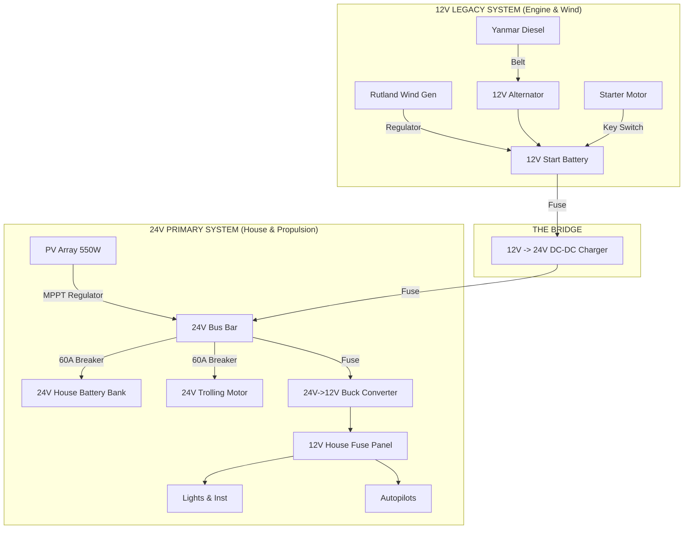

# 24V Solar Charging & Power System for YachtArion

## System Overview

This document describes the **Hybrid 24V/12V Power System** for YachtArion. The system transitions the primary House and Propulsion banks to **24V** for efficiency, while integrating legacy **12V** components (Yanmar engine, alternator, wind generator) via a smart DC-DC charging bridge.

### System Architecture

1.  **Primary Energy Bank (24V)**:
    *   **Source 1**: 550W Solar Array (MPPT Charging).
    *   **Source 2**: Engine/Wind charging from 12V side via DC-DC Charger.
    *   **Loads**: Electric Propulsion (Trolling Motor), House 12V Buck Converter.

2.  **Legacy 12V System (Engine & Wind)**:
    *   **Battery**: 12V Start Battery (Isolated).
    *   **Sources**: 12V Alternator (Yanmar), 12V Wind Generator (Rutland).
    *   **Loads**: Engine Starter, Bilge pumps (optional direct 12V safety).

3.  **The Bridge (12V → 24V)**:
    *   A **12V-to-24V DC-DC Battery Charger** (e.g., Victron Orion-Tr Smart).
    *   automatically charges the 24V House Bank whenever the Engine or Wind Generator raises the 12V voltage above ~13.5V (engine running).

### System Components

-   **Solar Array**: 2 × JA Solar JAP60S01-275/SC (275W each, 550W total)
-   **24V House/Prop Bank**: 2 × 12V lead-acid batteries in series (200Ah @ 24V)
-   **12V Start Battery**: 1 × 12V Cranking Battery (Standard marine)
-   **Solar Controller**: 60A MPPT (Charges 24V Bank)
-   **DC-DC Bridge**: 12V Input → 24V Output, ~18A-30A Charger (Charges 24V Bank from Alternator/Wind)
-   **House Buck**: 24V → 12V Converter (Powers instruments/lights)
-   **Propulsion**: 24V Trolling Motor (90 lb thrust)

### Voltage & Power Specifications

**Solar Panels (per unit at STC)**:
-   Maximum Power: 275W
-   Voltage at MPP (Vmp): 31.34V
-   Current at MPP (Imp): 8.77A
-   Open Circuit Voltage (Voc): 38.38V

**Battery Banks**:
| Bank | Nominal | Config | Charging Sources |
| :--- | :--- | :--- | :--- |
| **House / Prop** | 24V | 2×12V Series | Solar (MPPT), Engine/Wind (via DC-DC) |
| **Engine Start** | 12V | 1×12V Single | Alternator, Wind Gen |

## Electrical System Architecture

### Hybrid Block Diagram

### Detailed Wiring Topology

#### 1. Solar Charging (Primary)
*   **Panels**: Wired in parallel to preserve 31V Vmp (ideal for 24V MPPT bucking).
*   **Controller**: MPPT charges the **24V Bank** directly.

#### 2. Engine & Wind Charging (Secondary)
*   **Alternator**: Remains standard 12V. Connected directly to **12V Start Battery**.
*   **Wind Gen**: Connected to **12V Start Battery** (via its own regulator).
*   **Logic**:
    1.  When Engine runs, Alternator raises Start Battery to ~14.4V.
    2.  **DC-DC Charger** detects voltage >13.5V (engine on).
    3.  DC-DC Charger turns ON and boosts 12V → 28.8V to charge the **24V House Bank**.
    4.  Solar + Alternator currents combine at the 24V Bank.

#### 3. Load Distribution
*   **24V Loads**: Trolling motor connected directly to 24V Bus.
*   **12V House Loads**: Powered by the **House Buck Converter** (24V -> 12V). This ensures house lights/radios don't dim when the engine cranks.
*   **Emergency Starting**: A simple jumper cable or provisional switch can manually parallel the "bottom" 12V battery of the House Bank to the Starter Battery if the Starter battery dies.

## Updated Equipment List

### Major Components
| Item | Spec | Purpose | Notes |
| :--- | :--- | :--- | :--- |
| **MPPT Controller** | 60A, 150V+ Voc | Solar Regulation | e.g. Amptron / Victron MPPT 100/50 |
| **DC-DC Charger** | **12V Input / 24V Output**, 15-20A | Bridge Alternator to House | **[NEW]** e.g. Victron Orion-Tr Smart 12/24-18 |
| **House Buck** | 24V In / 12V Out, 20-30A | House Power | Existing Golf-cart style Isolated converter |
| **Batteries** | 2x 12V AGM/Flooded | House Bank | 200Ah each = 24V 200Ah Bank |
| **Start Battery** | 1x 12V CCA Rated | Engine Start | Existing |

### DC-DC Charger Specification
The bridge device is critical. A "Victron Orion-Tr Smart 12/24-18 Isolated" is recommended:
*   **Input**: 10-17V (12V system)
*   **Output**: 20-30V Adjustable (Charges 24V Bank)
*   **Current**: ~18A output (~360W transfer).
*   **Engine Detection**: Built-in. Only draws power when alternator is spinning.

If using a generic "Boost Converter":
*   You MUST add an ignition-controlled relay on the input, otherwise it will drain the start battery when the engine is off.

## Build & Installation Instructions

### Phase 1: 12V Legacy Prep
1.  **Keep it standard**: Do not modify the Yanmar alternator or starter wiring. Ensure they are reliably connected to the Start Battery.
2.  **Wind Generator**: Connect the Rutland regulator output to the Start Battery.
3.  **Grounding**: Ensure the Engine Block Ground is tied to the Start Battery Negative.

### Phase 2: 24V House Bank Assembly
1.  Install the 2 × 12V batteries in the battery box.
2.  Connect Series Link (Batt 1 (+) to Batt 2 (-)) using 2AWG/35mm² cable.
3.  **Main Ground Bus**: Connect Batt 1 (-) to the centralized negative bus.
4.  **Main Positive Bus**: Connect Batt 2 (+) to the main 24V fuse/switch.

### Phase 3: The DC-DC Bridge
1.  **Input Side**:
    *   Run 6AWG (16mm²) cable from Start Battery (+) to DC-DC Input (+).
    *   Run 6AWG (16mm²) cable from Start Battery (-) to DC-DC Input (-).
    *   *Fuse*: 60A fuse near the Start Battery.
2.  **Output Side**:
    *   Run 8AWG (10mm²) cable from DC-DC Output (+) to 24V House Bus (+).
    *   Run 8AWG (10mm²) cable from DC-DC Output (-) to 24V House Bus (-).
    *   *Fuse*: 30A fuse near the House Bus.
3.  **Configuration**:
    *   Set DC-DC output to "Charger Mode".
    *   Set Bulk: 28.8V, Float: 27.2V.
    *   Set "Engine Shutdown Detection" to Start > 13.5V, Stop < 12.8V.

### Phase 4: Common Negative & Bonding
> [!WARNING]
> **Ground Loop Risk**: Even if using isolated converters, all battery negatives (12V Start and 24V House) generally share a common hull bond/engine ground for safety (ABYC standards).
> However, signal noise can be an issue.
>
> *Recommended*: Tie the **12V Start Negative** to the **24V House Negative** at a single "System Ground Point" (usually the engine block or main busbar). This allows the Alternator return current to flow correctly if non-isolated wiring is ever used, and ensures substantial safety bonding.
>
> If using **Isolated** DC-DC transformers (Orion-Tr *Isolated*), you *can* keep the grounds separate, but check your Autopilot/Instrument ground paths. Often the autopilot computer touches both power ground and NMEA data ground, forcing a common ground anyway. **Plan for a common negative system.**

## Critical Warning: Load Terminals & Ground Loops

> [!CAUTION]
> **DO NOT connect your Autopilot or Raspberry Pis to the "Load" terminals of the solar controller.**
>
> 1.  **Common Positive Design**: The cheap yellow/orange solar controllers (like the one pictured) often switch the **Negative** line to control loads. This means "Load Negative" is NOT the same as "Battery Negative".
> 2.  **The "Backdoor Ground" Trap**:
>     *   Your Raspberry Pi connects to the Arduino (USB).
>     *   The Arduino connects to the IBT-2 Motor Controller.
>     *   The IBT-2 connects directly to the **Battery Negative** (High Current Bus).
>     *   **Result**: Your Pi is grounded to the battery via the USB/Signal cables.
> 3.  **The Smoke Scenario**:
>     *   If you power the Pi from the Solar "Load" terminals and the controller tries to switch it OFF (or PWM dims it), the ground path is broken *at the controller*.
>     *   The current will try to find a way back to the battery. It will flow through the **thin USB signal wires** -> Arduino -> IBT-2 -> Battery.
>     *   **Outcome**: Melted USB cables and a fried Raspberry Pi/Arduino.
>
> **Solution**: Power your 24V->5V Buck Converters directly from the **24V Fuse Block (Bus A)**. Do not pass Go, do not touch the Load terminals.

## Start Battery Protection
The propulsion motor draws purely from the 24V bank. You cannot accidentally flatten the start battery by motoring too long.
*   **House Dead?**: Engine still starts (independent battery).
*   **Start Dead?**: Use a jumper cable from House Bank "Bottom Battery" (12V) to Jump Start.

---

**Document Version**: 2.1 (Ground Loop Warnings)
**Last Updated**: January 21, 2026

