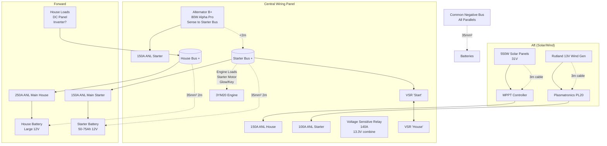

# Arion Dual Battery Charging System

## Overview
This document details the dual battery system for Arion (36ft pilot-house sloop, Yanmar 3YM20 20hp), transitioning from single house battery to separate starter (small, 50-75Ah) and house (large 12V). Central wiring panel (2m aft of batteries forward, 3m forward of solar/wind aft) hosts VSR, MPPT (550W solar), PL20 (Rutland wind), buses/fuses. Alternator (80W Alpha Pro) and wind prioritize starter; solar direct house; VSR combines >13.3V. Ensures starter reliability, house capacity.[1][2]

## System Diagram

## Installation Steps
1. **Prep:** Disconnect existing battery. Mount starter battery forward near house. Install panel components: VSR, controllers, tinned bus bars (300A pos/neg), ANL fuse holders (label).[3]
2. **Negatives first:** Run 35mm² tinned from batteries to common neg bus; parallel engine/DC neg.
3. **Panel wiring:** 
   - Alt B+ (16mm²) → starter fuse → starter bus.
   - Alpha Pro (brown REG ON, red +BAT 10mm²) → starter bus.
   - Wind (10mm²) → PL20 → starter fuse/bus.
   - Solar (16mm²) → MPPT → house fuse/bus.
   - VSR studs: starter bus → 'Start/A1', house bus → 'House/A2'.
4. **Forward cables:** 35mm² pos: house bus → 250A fuse → house +; starter bus → 150A → starter +.
5. **Loads:** House DC panel (fused breakers) from house bus; engine harness to starter bus.
6. **Test:** Volt meter across—charge sources solo (14.4V), engine run (VSR closes, equalizes), loads off starter.[4][2]
7. **Safety:** Chafe protection, Loctite lugs, IP54 enclosure, AMSA-compliant labeling/fuses.[5]

## Bill of Materials (BOM)
| Item | Qty | Spec/Details | AU Supplier/Est. Cost |
|------|-----|--------------|-----------------------|
| Starter Battery | 1 | 50-75Ah AGM 12V CCA 500+ | Battery World $200[6] |
| VSR | 1 | 140A 12V marine IP67 (Deck-Tech/BlueSea) | Whitworths $120[7] |
| ANL Fuses | 6 | 150A (starter), 250A (house main) | Jaycar $15ea |
| Fuse Holders | 6 | Waterproof ANL 300A | Whitworths $20ea |
| Bus Bars | 2 | Tinned brass 300A 8-stud pos/neg | Jaycar $25ea |
| Tinned Cable | 20m | 35mm² red/black (2m forward runs) | Whitworths $5/m |
| Tinned Cable | 10m | 16mm² (aft/engine) | $3/m |
| Crimps/Lugs | Lot | 35mm² M10 ring tinned | $50 |
| Heat Shrink/Loctite | Lot | Adhesive lined 12-50mm | $30 |
| Battery Switch | 1 | Double pole 300A (house isolator) | $50 |
| Labels/Ties | Lot | Marine grade | $20 |
| **Total** | | | **~$900** [1] |

## Troubleshooting
- **No start:** Check starter fuse/cable continuity, battery >12.6V, solenoid click. [8]
- **Alternator no charge:** Alpha Pro LED? Sense wires to starter bus, belt tension $$ 10mm $$ deflection. 
- **VSR not combining:** Measure house V >13.3V engine on; polarity reverse? [9]
- **Low solar/wind:** Clean panels/blades; PL20/MPPT LCD faults (overvolt dump). [10]
- **Voltage drop:** >0.2V? Upsize cable, clean terminals (bicarb). Calc: $$ \Delta V = 2 \times L \times I \times R $$ (R per km).[7]
- **Overheat:** Fuses blow—check shorts/loads >140A sustained.

**Maintenance:** Monthly volts/terminals; annual load test. Reference: Yanmar YM manual, Alpha Pro PDF.[11][12]

Citations:
[1] Fundamental Boat Electrical System Design https://www.outbackmarine.com.au/applications/boat-and-yacht-electrical-systems/fundamental-boat-electrical-system-design/
[2] What are VSR and How to install a VSR - FAQs https://www.yismarine.com/en/faq/faq_03_VSR.html
[3] Install Your Marine Dual Battery Setup https://www.abyssbattery.com/blogs/news/install-your-marine-dual-battery-setup
[4] Split Charging, Voltage Sensitive Relay VSR - How to, review ... https://www.youtube.com/watch?v=-9UKAMM19vs
[5] INSTRUCTIONS TO SURVEYORS https://www.amsa.gov.au/sites/default/files/2023-11/dcv-its-015.pdf
[6] Engine: Yanmar 3YM20 with stock alternator. All ... https://www.facebook.com/groups/victronenergyusergroup/posts/1047519570522982/
[7] Deck Tech 12V Voltage Sensitive Relay (VSR) - 140A https://www.whitworths.com.au/deck-tech-12v-voltage-sensitive-relay-vsr-automatic-charging-relay-140a
[8] Wiring a starter battery - a word of caution https://forums.sailboatowners.com/threads/wiring-a-starter-battery-a-word-of-caution.39134/
[9] digital voltage sensitive relay https://www.hella.co.nz/content/showfile.php?downloadid=1375
[10] Plasmatronics PL20 20A Solar Charge Controller - ecoCool https://www.ecocool.com.au/products/solar-charge/plasmatronics-pl20-20a-solar-charge-controller/
[11] YM Series Operation Manual https://www.yanmar.fi/content/download/13983/102776/file/YM_OM_English.pdf
[12] ALPHA PRO https://www.emarinesolutions.com.au/assets/files/10000021727_01-manualAlphaPro-EN.pdf
[13] Does anybody have a wiring diagram fir a yacht, with ... https://www.facebook.com/groups/victronenergyusergroup/posts/920717713203169/
[14] Marine Electrical Systems https://www.whitsundaydiscountmarine.com.au/assets/files/DIY%20Boating%20Magazine/Electrical/Marine%20Electrical%20Systems.pdf
[15] VSR Question - TechTalk https://crew.org.nz/forum/index.php?%2Fforums%2Ftopic%2F26640-vsr-question%2F
[16] Suitable wiring diagram--photo https://forums.ybw.com/threads/suitable-wiring-diagram-photo.492349/post-6289558
[17] Yanmar - 3ym 2ym Service Manual | PDF | Piston | Engines https://www.scribd.com/document/460753295/yanmar-3ym-2ym-service-manual
[18] Bussmann 300A 2 Pole M8 STUD Battery Mounted Marine ... https://www.autoelectricalparts.com.au/bussmann-300a-2-pole-m8-stud-battery-mounted-marine-rated-battery-fuse-bar-double-pole-kit.html
[19] Digital Voltage Sensing Relay https://www.swiftcotrailers.com.au/images/attachment-files/Digital%20Voltage%20Sensing%20Relay.pdf
[20] Service Manual for Marine Diesel Engine https://j109.org/docs/yanmar_3ym-2ym-service-manual.pdf
[21] BASIC BOAT DUAL BATTERY WIRING | HOW TO - YouTube https://www.youtube.com/watch?v=8HLmflsKT3I
[22] Battery Management Wiring Schematics - Typical Applications https://www.bluesea.com/resources/170/Battery_Management_Wiring_Schematics_for_Typical_Applications
[23] Moving from 1,2,Both switch to VSR https://forums.ybw.com/threads/moving-from-1-2-both-switch-to-vsr.534650/
[24] 3YM30/3YM20/2YM15 https://engine-manual.com/fr/index.php?controller=attachment&id_attachment=230
