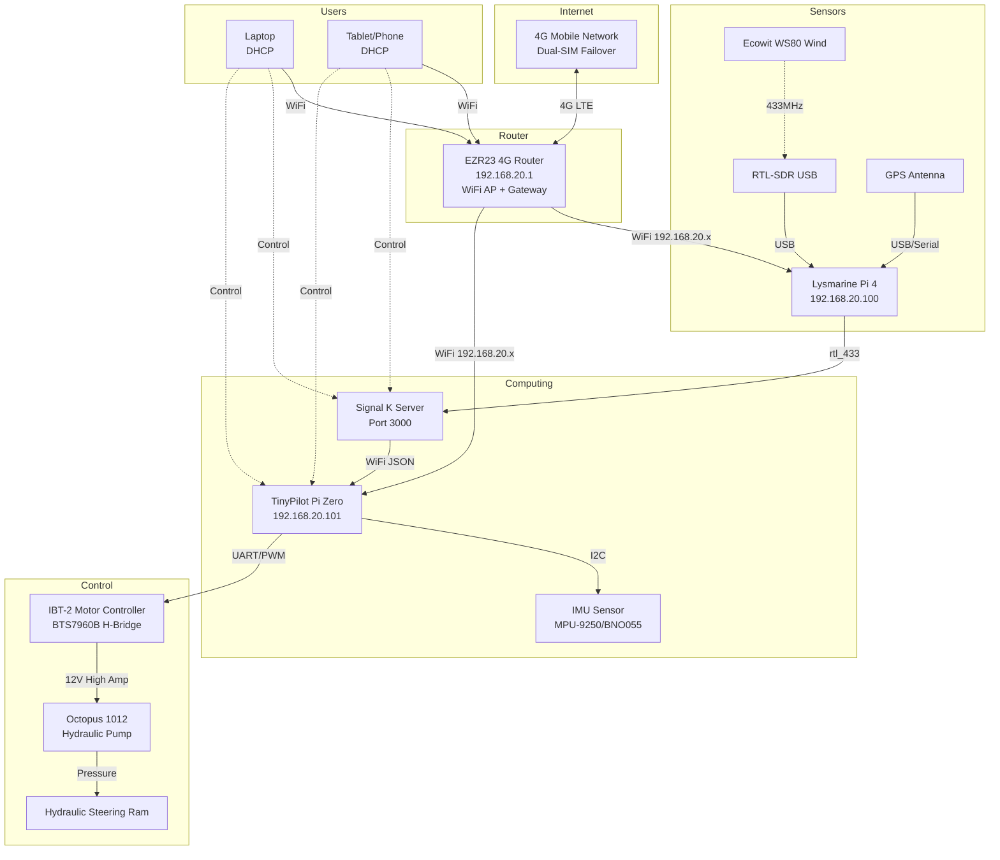

# Network & Data Topology Map

## Physical Network
*   **SSID**: `YachtArion`
*   **Gateway / AP**: EZR23 4G Router (192.168.20.1)
*   **Subnet Mask**: 255.255.255.0 (/24)
*   **DHCP Range**: 192.168.20.50 - 192.168.20.150
*   **Internet Access**: Dual-SIM 4G LTE with automatic failover
*   **WiFi Coverage**: ~100-200 yards (27dBm high-gain)

## Static IP Allocations

| Device | IP Address | MAC Address | Role |
| :--- | :--- | :--- | :--- |
| **EZR23 Router** | `192.168.20.1` | (Check router label) | Gateway / DHCP Server / 4G Internet / WiFi AP |
| **Lysmarine** | `192.168.20.100` | (Pi 4 - TBD) | Navigation / OpenCPN / Signal K Server |
| **TinyPilot** | `192.168.20.101` | (Pi Zero - TBD) | Autopilot Core / Motor Control |
| **User Laptop**| DHCP (50-150) | - | Configuration / Monitoring |
| **Tablet/Phone**| DHCP (50-150) | - | Remote Display / Control |

**Note**: Configure static DHCP reservations on the router using MAC addresses once devices are commissioned.

## Service Ports

| Service | Port | Host | Address | Description |
| :--- | :--- | :--- | :--- | :--- |
| **Router Admin** | `80` | EZR23 | `http://192.168.20.1` | Router configuration interface |
| **Signal K Admin** | `3000` | Lysmarine | `http://192.168.20.100:3000` | Sensor Dashboard & Config |
| **OpenCPN** | `None` | Lysmarine | Local display only | Navigation/Charting Software |
| **Pypilot Web** | `80` | TinyPilot | `http://192.168.20.101` | Autopilot Web UI |
| **Pypilot Control**| `20220` | TinyPilot | `192.168.20.101:20220` | JSON Control API (OpenCPN Plugin) |
| **SSH** | `22` | Both Pis | `ssh pi@192.168.20.10x` | Remote Command Line |
| **VNC** | `5900` | Lysmarine | `192.168.20.100:5900` | Remote Desktop to Chartplotter |

## Router Configuration

### Power
- **Input Voltage**: 9-48V DC (12V nominal)
- **Current Draw**: ~2A at 12V (24W typical)
- **Protection**: 5A fuse on positive lead from House Bus A
- **Wire Gauge**: Minimum 18 AWG / 0.75mm²

### Mobile Interface (4G)
- **Primary SIM**: Slot 1 (configured with carrier APN)
- **Secondary SIM**: Slot 2 (optional backup/failover)
- **Failover**: Automatic on network loss
- **Expected Coverage**: Check RSRP/RSRQ in router status page

### Antennas
- **Mobile (4G)**: 2x SMA connectors for external LTE antennas
- **WiFi**: 2x SMA connectors for high-gain WiFi antennas
- **Recommendation**: Mount 4G antennas as high as practical for best signal

## Power Distribution for Network Devices

All devices powered from **House Bus A** via individual fused circuits:

| Device | Input Voltage | Buck Converter | Fuse Size | Wire Gauge |
| :--- | :--- | :--- | :--- | :--- |
| **EZR23 Router** | 12V (native) | None | 5A | 18 AWG |
| **Lysmarine Pi 4** | 5V | 12V→5V Buck | 2A | 18 AWG |
| **TinyPilot Pi Zero** | 5V | 12V→5V Buck | 1A | 18 AWG |
| **Arduino Motor Controller** | 5V | 12V→5V Buck | 2A | 18 AWG |
| **Rudder Feedback (if separate)** | 5V/12V | As required | 1A | 18 AWG |

**Note**: All negative/ground connections share common negative bus bonded to engine ground.

## Signal Flow



## Network Configuration Steps

### 1. Configure Router (see docs/EZR23_router_setup.md)

```bash
# Access router at default address
http://192.168.20.1

# Configure:
# - WiFi SSID: YachtArion
# - WiFi Password: [Strong password]
# - Mobile APN: [Carrier specific]
# - DHCP range: 192.168.20.50-150
```

### 2. Configure Static IPs on Raspberry Pis

**Lysmarine (192.168.20.100)**:
```bash
sudo nmcli con mod "YachtArion" ipv4.addresses 192.168.20.100/24
sudo nmcli con mod "YachtArion" ipv4.gateway 192.168.20.1
sudo nmcli con mod "YachtArion" ipv4.dns "8.8.8.8 1.1.1.1"
sudo nmcli con mod "YachtArion" ipv4.method manual
sudo nmcli con up "YachtArion"
```

**TinyPilot (192.168.20.101)**:
```bash
sudo nmcli con mod "YachtArion" ipv4.addresses 192.168.20.101/24
sudo nmcli con mod "YachtArion" ipv4.gateway 192.168.20.1
sudo nmcli con mod "YachtArion" ipv4.dns "8.8.8.8 1.1.1.1"
sudo nmcli con mod "YachtArion" ipv4.method manual
sudo nmcli con up "YachtArion"
```

### 3. Verify Connectivity

```bash
# From either Pi, test local network
ping 192.168.20.1          # Router
ping 192.168.20.100        # Lysmarine
ping 192.168.20.101        # TinyPilot

# Test internet via 4G
ping 8.8.8.8
ping google.com

# Check routing
ip route show
# Should show: default via 192.168.20.1 dev wlan0
```

### 4. Configure Signal K Connections

In Signal K Admin (`http://192.168.20.100:3000`):

- Add pypilot connection:
  - **Protocol**: TCP
  - **Host**: `192.168.20.101`
  - **Port**: `20220`

### 5. Configure OpenCPN Pypilot Plugin

In OpenCPN pypilot plugin settings:

- **Host**: `192.168.20.101`
- **Port**: `20220`

## Troubleshooting

### Cannot Access Router

```bash
# Check WiFi connection
iwconfig
nmcli dev status

# Try connecting via Ethernet if available
# Reset router to defaults if necessary (hold reset button)
```

### Pis Cannot See Each Other

```bash
# Check IP configuration
ip addr show wlan0

# Check routing table
ip route

# Verify both on same subnet (192.168.20.x)
# Check router firewall settings (should allow LAN-to-LAN by default)
```

### No Internet via 4G

```bash
# Check router status page for mobile connection
# Verify SIM has data and is not blocked
# Check APN settings match carrier requirements
# Confirm DNS servers are configured (8.8.8.8, 1.1.1.1)
```

### Signal K Cannot Connect to Pypilot

```bash
# From Lysmarine, test pypilot port
telnet 192.168.20.101 20220

# If connection refused, check pypilot is running:
ssh pi@192.168.20.101
sudo systemctl status pypilot

# Check pypilot is listening on correct port:
sudo netstat -tlnp | grep 20220
```

## Security Considerations

### Router Access
- Change default admin password immediately
- Disable remote management from WAN if enabled
- Keep router firmware updated

### Pi Security
- Change default `pi` user password
- Enable SSH key authentication
- Disable password authentication for SSH (after keys configured)
- Keep OS and pypilot software updated

### WiFi Security
- Use WPA2 or WPA3 encryption
- Use strong WiFi password (minimum 16 characters)
- Disable WPS if enabled
- Consider hiding SSID broadcast when not actively needed

## Maintenance

### Regular Checks
- Monitor router 4G signal strength (RSRP/RSRQ)
- Check data usage if on metered plan
- Verify dual-SIM failover functionality before extended passages
- Test backup connectivity options

### Backup Connectivity
- Keep Pixel 2 as backup hotspot
- Document alternate APN settings for different carriers
- Consider satellite backup for offshore passages

## References

- [EZR23 Router Setup](./EZR23_router_setup.md) - Detailed router configuration
- [Pypilot User Manual](https://pypilot.org/doc/pypilot_user_manual/)
- [Signal K Documentation](https://signalk.org/)
- [12V Solar System](./12v_solar_system.md) - Power system details