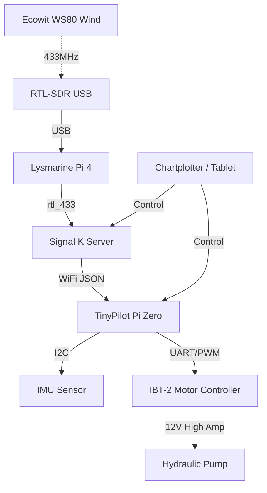

# Network & Data Topology Map

## Physical Network
*   **SSID**: `YachtArion`
*   **Gateway / AP**: Pixel 2 Phone (192.168.43.1)
*   **Subnet Mask**: 255.255.255.0

## Static IP Allocations

| Device | IP Address | MAC Address | Role |
| :--- | :--- | :--- | :--- |
| **Gateway** | `192.168.43.1` | (Pixel 2) | DHCP Server / Internet Access |
| **Lysmarine** | `192.168.43.100` | (Pi 4) | Navigation / OpenCPN / Signal K |
| **TinyPilot** | `192.168.43.101` | (Pi Zero) | Autopilot Core / Motor Control |
| **User Laptop**| DHCP | - | Configuration / Monitoring |
| **Tablet/Phone**| DHCP | - | Remote Display |

## Service Ports

| Service | Port | Host | Description |
| :--- | :--- | :--- | :--- |
| **Signal K Admin** | `3000` | Lysmarine | Sensor Dashboard & Config |
| **OpenCPN** | `None` | Lysmarine | Local Display |
| **Pypilot Web** | `80` | TinyPilot | Autopilot Web UI |
| **Pypilot Control**| `20220` | TinyPilot | JSON Control API (OpenCPN Plugin target) |
| **SSH** | `22` | Both Pis | Remote Command Line |
| **VNC** | `5900` | Lysmarine | Remote Desktop to Chartplotter |

## Signal Flow

