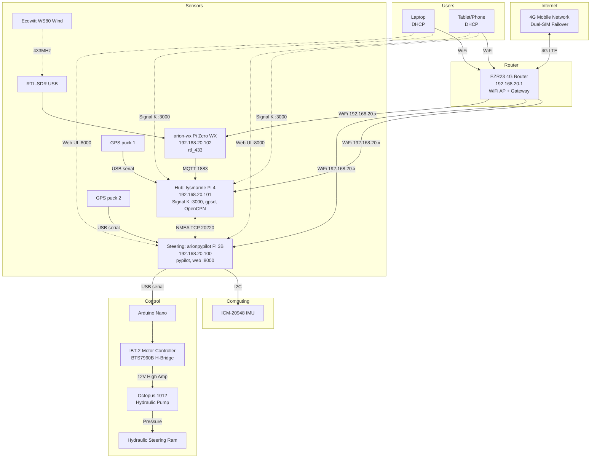

# Network & Data Topology Map

> Verified 2026-10-07: .100 = steering Pi 3B (`arionpypilot`), .101 = hub Pi 4 (`lysmarine`), .102 = wind Pi Zero WX (`arion-wx`). SSH user is `bbb` on all Pis. Signal K / gpsd / OpenCPN data-flow details: see [data_flows.md](./data_flows.md).

## Physical Network
*   **SSID**: `YachtArion`
*   **Gateway / AP**: EZR23 4G Router (192.168.20.1)
*   **Subnet Mask**: 255.255.255.0 (/24)
*   **DHCP Range**: 192.168.20.50 - 192.168.20.150
*   **Internet Access**: Dual-SIM 4G LTE with automatic failover
*   **WiFi Coverage**: ~100-200 yards (27dBm high-gain)

## Static IP Allocations

| Device | IP Address | Configuration Method | Role |
| :--- | :--- | :--- | :--- |
| **EZR23 Router** | `192.168.20.1` | Router default | Gateway / DHCP Server / 4G Internet / WiFi AP |
| **Steering node** (`arionpypilot`, Pi 3B) | `192.168.20.100` | Static on Pi | pypilot server + web UI / IMU / Arduino motor controller / second GPS puck |
| **Hub** (`lysmarine`, Pi 4) | `192.168.20.101` | Static on Pi | Signal K / Mosquitto / InfluxDB / Grafana / OpenCPN / gpsd + first GPS puck / Tailscale |
| **Wind bridge** (`arion-wx`, Pi Zero WX) | `192.168.20.102` | Static on Pi | Ecowitt WS80 via rtl_433 -> MQTT (read-only overlayroot) |
| **User Laptop**| DHCP (50-150) | DHCP | Configuration / Monitoring |
| **Tablet/Phone**| DHCP (50-150) | DHCP | Remote Display / Control |

**Note**: Static IPs are configured directly on each Raspberry Pi for easier hardware replacement in marine environments. If a board fails, a replacement can be configured with the same IP without router changes.

## Service Ports

| Service | Port | Host | Address | Description |
| :--- | :--- | :--- | :--- | :--- |
| **Router Admin** | `80` | EZR23 | `http://192.168.20.1` | Router configuration interface |
| **Signal K Admin** | `3000` | Hub (lysmarine) | `http://192.168.20.101:3000` | Sensor Dashboard & Config |
| **Signal K NMEA0183 out** | `10110` | Hub (lysmarine) | `192.168.20.101:10110` | NMEA TCP output |
| **Mosquitto MQTT** | `1883` | Hub (lysmarine) | `192.168.20.101:1883` | Wind bridge publishes here |
| **OpenCPN** | `None` | Hub (lysmarine) | Local display only | Navigation/Charting Software (runs as desktop user `user`, reads gpsd 127.0.0.1:2947) |
| **Pypilot Web** | `8000` | Steering (arionpypilot) | `http://192.168.20.100:8000` | Autopilot Web UI |
| **pypilot server** | `23322` | Steering (arionpypilot) | `192.168.20.100:23322` | pypilot internal pub/sub bus |
| **pypilot NMEA** | `20220` | Steering (arionpypilot) | `192.168.20.100:20220` | NMEA TCP (read by Signal K `Pypilot_Raw_Data`) |
| **SSH** | `22` | All Pis | `ssh bbb@192.168.20.10x` | Remote Command Line |
| **VNC** | `5900` | Hub (lysmarine) | `192.168.20.101:5900` | Remote Desktop to Chartplotter (unverified) |

## Router Configuration

### Power
- **Input Voltage**: 9-48V DC (12V nominal)
- **Current Draw**: ~2A at 12V (24W typical)
- **Protection**: 5A fuse on positive lead from House Bus A
- **Wire Gauge**: Minimum 18 AWG / 0.75mm²

### Mobile Interface (4G)
- **Primary SIM**: Slot 1 (configured with carrier APN)
- **Secondary SIM**: Slot 2 (optional backup/failover)
- **Failover**: Automatic on network loss
- **Expected Coverage**: Check RSRP/RSRQ in router status page

### Antennas
- **Mobile (4G)**: 2x SMA connectors for external LTE antennas
- **WiFi**: 2x SMA connectors for high-gain WiFi antennas
- **Recommendation**: Mount 4G antennas as high as practical for best signal

## Power Distribution for Network Devices

All devices powered from **House Bus A** via individual fused circuits:

| Device | Input Voltage | Buck Converter | Fuse Size | Wire Gauge |
| :--- | :--- | :--- | :--- | :--- |
| **EZR23 Router** | 12V (native) | None | 5A | 18 AWG |
| **Hub Pi 4 (lysmarine)** | 5V | 12V→5V Buck | 2A | 18 AWG |
| **Steering Pi 3B (arionpypilot)** | 5V | 12V→5V Buck | 1A | 18 AWG |
| **Arduino Motor Controller** | 5V | 12V→5V Buck | 2A | 18 AWG |
| **Rudder Feedback (if separate)** | 5V/12V | As required | 1A | 18 AWG |

**Note**: All negative/ground connections share common negative bus bonded to engine ground.

## Signal Flow


```mermaid
graph TD
    subgraph Internet
        Mobile[4G Mobile Network<br/>Dual-SIM Failover]
    end
    
    subgraph Router
        EZR23[EZR23 4G Router<br/>192.168.20.1<br/>WiFi AP + Gateway]
    end
    
    subgraph Sensors
        WS80[Ecowitt WS80 Wind] -.->|433MHz| RTL[RTL-SDR USB]
        RTL --> WX[arion-wx Pi Zero WX<br/>192.168.20.102<br/>rtl_433]
        GPS1[GPS puck 1] -->|USB serial| Hub
        GPS2[GPS puck 2] -->|USB serial| Steer
    end

    subgraph Computing
        WX -->|MQTT 1883| Hub[Hub: lysmarine Pi 4<br/>192.168.20.101<br/>Signal K :3000, gpsd, OpenCPN]
        Hub <-->|NMEA TCP 20220| Steer[Steering: arionpypilot Pi 3B<br/>192.168.20.100<br/>pypilot, web :8000]
        Steer -->|I2C| IMU[ICM-20948 IMU]
    end

    subgraph Control
        Steer -->|USB serial| Nano[Arduino Nano]
        Nano --> IBT2[IBT-2 Motor Controller<br/>BTS7960B H-Bridge]
        IBT2 -->|12V High Amp| Pump[Octopus 1012<br/>Hydraulic Pump]
        Pump -->|Pressure| Steering[Hydraulic Steering Ram]
    end

    subgraph Users
        Laptop[Laptop<br/>DHCP] -->|WiFi| EZR23
        Tablet[Tablet/Phone<br/>DHCP] -->|WiFi| EZR23
    end
    
    Mobile <-->|4G LTE| EZR23
    EZR23 -->|WiFi 192.168.20.x| Hub
    EZR23 -->|WiFi 192.168.20.x| Steer
    EZR23 -->|WiFi 192.168.20.x| WX
    
    Laptop -.->|Signal K :3000| Hub
    Tablet -.->|Signal K :3000| Hub
    Laptop -.->|Web UI :8000| Steer
    Tablet -.->|Web UI :8000| Steer
```

## Network Configuration Steps

### 1. Configure Router (see docs/EZR23_router_setup.md)

```bash
# Access router at default address
http://192.168.20.1

# Configure:
# - WiFi SSID: YachtArion
# - WiFi Password: [Strong password]
# - Mobile APN: [Carrier specific - telstra.internet for Telstra]
# - DHCP range: 192.168.20.50-150 (excludes .100 and .101)
# - Assign mobile interface to WAN firewall zone
```

### 2. Configure Static IPs on Raspberry Pis

**Important**: Static IPs are configured on the Pis themselves (not DHCP reservations) for easier hardware replacement. This allows you to swap a failed Pi with a pre-configured replacement without touching router settings.

#### Hub - lysmarine (192.168.20.101)

**Using nmcli (NetworkManager - recommended)**:
```bash
# SSH into the hub Pi
ssh bbb@192.168.20.x  # Initially will have DHCP address

# Configure static IP on YachtArion WiFi connection
sudo nmcli con mod "YachtArion" ipv4.addresses 192.168.20.101/24
sudo nmcli con mod "YachtArion" ipv4.gateway 192.168.20.1
sudo nmcli con mod "YachtArion" ipv4.dns "8.8.8.8 1.1.1.1"
sudo nmcli con mod "YachtArion" ipv4.method manual
sudo nmcli con up "YachtArion"

# Verify configuration
ip addr show wlan0
ping 192.168.20.1
```

**Alternative: Edit dhcpcd.conf (for Raspberry Pi OS Lite)**:
```bash
sudo nano /etc/dhcpcd.conf

# Add at the end:
interface wlan0
static ip_address=192.168.20.101/24
static routers=192.168.20.1
static domain_name_servers=8.8.8.8 1.1.1.1

# Save and restart
sudo systemctl restart dhcpcd
```

#### Steering node - arionpypilot (192.168.20.100)

**Using nmcli**:
```bash
# SSH into the steering Pi
ssh bbb@192.168.20.x  # Initially will have DHCP address

# Configure static IP
sudo nmcli con mod "YachtArion" ipv4.addresses 192.168.20.100/24
sudo nmcli con mod "YachtArion" ipv4.gateway 192.168.20.1
sudo nmcli con mod "YachtArion" ipv4.dns "8.8.8.8 1.1.1.1"
sudo nmcli con mod "YachtArion" ipv4.method manual
sudo nmcli con up "YachtArion"

# Verify
ip addr show wlan0
ping 192.168.20.1
ping 192.168.20.101  # Test connectivity to the hub
```

**Alternative: Edit dhcpcd.conf**:
```bash
sudo nano /etc/dhcpcd.conf

# Add at the end:
interface wlan0
static ip_address=192.168.20.100/24
static routers=192.168.20.1
static domain_name_servers=8.8.8.8 1.1.1.1

# Save and restart
sudo systemctl restart dhcpcd
```

### 3. Verify Connectivity

```bash
# From either Pi, test local network
ping 192.168.20.1          # Router
ping 192.168.20.100        # Steering (arionpypilot)
ping 192.168.20.101        # Hub (lysmarine)
ping 192.168.20.102        # Wind bridge (arion-wx)

# Test internet via 4G
ping 8.8.8.8
ping google.com

# Check routing table
ip route show
# Should show: default via 192.168.20.1 dev wlan0

# Verify DNS resolution
nslookup google.com
```

### 4. Configure Signal K Connections

In Signal K Admin (`http://192.168.20.101:3000`):

- The pypilot connection is the `Pypilot_Raw_Data` provider (TCP, host `192.168.20.100`, port `20220`). See [data_flows.md](./data_flows.md) for the full provider list and GPS source priorities.

### 5. OpenCPN

OpenCPN runs on the hub and takes GPS from local gpsd (`127.0.0.1:2947`). If the OpenCPN pypilot plugin is used, point it at the steering node (`192.168.20.100`); the port is unverified (see owner confirmation).

## Hardware Replacement Procedure

**Advantage of Static IP Configuration**: When a Pi fails at sea, you can swap it with a spare that has been pre-configured with the same IP address. No router access needed.

### Preparing Spare Pis

1. Image SD cards with base OS (Lysmarine for the hub, Raspberry Pi OS / Debian for the steering node). The hub root is on a SATA SSD, not an SD card; the wind bridge uses a read-only overlayroot
2. Boot each spare and configure its static IP as shown above
3. Label SD cards clearly: "Hub (lysmarine) Spare - .101", "Steering (arionpypilot) Spare - .100" or "Wind bridge Spare - .102"
4. Store spares in waterproof case with documentation

### Swapping a Failed Pi

1. Power down the failed Pi
2. Remove SD card and replace with pre-configured spare
3. Power up - it will immediately acquire the correct IP address
4. No router configuration changes needed
5. Services (Signal K, pypilot) will be reachable at same addresses

**Note**: Keep backup images of working SD cards for creating new spares.

## Troubleshooting

### Cannot Access Router

```bash
# Check WiFi connection
iwconfig
nmcli dev status

# If connected but no access, check IP:
ip addr show wlan0
# Should show 192.168.20.100, .101 or .102

# Try pinging gateway
ping 192.168.20.1
```

### Pis Cannot See Each Other

```bash
# Check IP configuration on both
ip addr show wlan0

# Verify both have correct IPs:
# Steering (arionpypilot): 192.168.20.100
# Hub (lysmarine): 192.168.20.101
# Wind bridge (arion-wx): 192.168.20.102

# Check routing table
ip route

# Test connectivity
ping 192.168.20.101  # From steering node
ping 192.168.20.100  # From hub
```

### Static IP Not Applied After Reboot

```bash
# Check if configuration persisted
nmcli con show "YachtArion" | grep ipv4

# Or check dhcpcd.conf
cat /etc/dhcpcd.conf | grep -A 5 "interface wlan0"

# Re-apply if needed (see configuration steps above)
```

### IP Conflict Warning

**Symptoms**: Router or devices report duplicate IP address.

**Cause**: Static IPs (.100, .101, .102) overlap with DHCP range.

**Solution**: Ensure router DHCP range is `192.168.20.50-150` which excludes .100 and .101.

### No Internet via 4G

```bash
# Verify gateway is reachable
ping 192.168.20.1

# Check if router has internet
# (Access router web interface at http://192.168.20.1)

# Verify DNS is working
nslookup google.com

# Check routing
ip route show
# Must show: default via 192.168.20.1
```

### Signal K Cannot Connect to Pypilot

```bash
# From the hub (lysmarine), test pypilot NMEA port
telnet 192.168.20.100 20220

# If connection refused, check pypilot is running:
ssh bbb@192.168.20.100
sudo systemctl status pypilot

# Check pypilot is listening on correct interface:
sudo netstat -tlnp | grep 20220
# Should show: 0.0.0.0:20220 or 192.168.20.100:20220
```

## Security Considerations

### Router Access
- Change default admin password immediately
- Disable remote management from WAN if enabled
- Keep router firmware updated

### Pi Security
- Change default passwords on all Pis (SSH user is `bbb`)
- Enable SSH key authentication
- Consider disabling password authentication for SSH (after keys configured)
- Keep OS and pypilot software updated
- Document passwords in secure location (boat safe)

### WiFi Security
- Use WPA2 or WPA3 encryption
- Use strong WiFi password (minimum 16 characters)
- Disable WPS if enabled
- Document WiFi password for crew
- Consider hiding SSID broadcast when not actively cruising

## Maintenance

### Regular Checks
- Monitor router 4G signal strength (RSRP/RSRQ)
- Check data usage if on metered plan
- Verify dual-SIM failover functionality before extended passages
- Test backup connectivity options
- Verify spare Pi SD cards / SSD images boot correctly

### Before Extended Passages
- Test all network connections
- Verify internet access via 4G
- Confirm Signal K receiving pypilot data
- Check antenna connections are secure
- Test hardware replacement procedure with spares
- Document current configuration

### Backup Connectivity
- Keep Pixel 2 as backup hotspot (different subnet: 192.168.43.x; Pis would need their static IPs changed to that subnet, see [wireless_hotspot.md](archive/wireless_hotspot.md), which is legacy)
- Document alternate APN settings for different carriers
- Consider satellite backup for offshore passages
- Carry spare SIM cards for both carriers

## Configuration Backup

### Router Configuration
- Export router config via admin interface (System > Backup/Restore)
- Store backup file in repository or secure cloud storage
- Document APN settings, WiFi password, and any custom firewall rules

### Raspberry Pi Configuration
- Create SD card images of working systems:
  ```bash
  # From another Linux system with SD card
  sudo dd if=/dev/sdX of=arionpypilot-backup-YYYYMMDD.img bs=4M status=progress
  # (hub root is a SATA SSD, image it the same way from /dev/sdX)
  ```
- Store images on external drive
- Document all configuration changes in this repository

## References

- [EZR23 Router Setup](./EZR23_router_setup.md) - Detailed router configuration
- [Pypilot User Manual](https://pypilot.org/doc/pypilot_user_manual/)
- [Signal K Documentation](https://signalk.org/)
- [12V Solar System](./12v_solar_system.md) - Power system details
- [Raspberry Pi Network Configuration](https://www.raspberrypi.org/documentation/configuration/wireless/)
