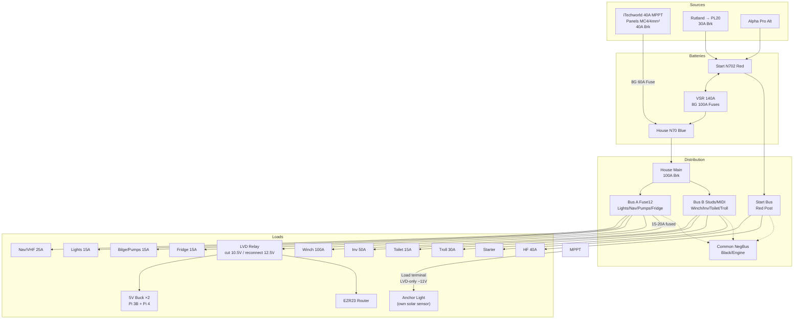

# rewiring_house_loads-12v.md

## Project Overview

Complete 12V house rewire for *Arion*: replace spaghetti with labelled buses/fuses, integrate iTechworld 40A MPPT solar (battery-direct), PL20 Rutland, VSR link—no solar load terminals. DIY from mooring w/ new cables/crimper/breakers.

## Electrical Topology

**Bus A: 12V House (Clean, 60A total)** → Fuseholder #1 (12 slots): nav/lights/pumps/fridge.  
**Bus B: 12V High Current (100A+)** → Red studs/MIDI: winch/inverter/toilet/troll.  
**Start Bus**: Isolated cranking + HF/PL20 wind. Common NegBus engine bond.[file:11-13]

**Critical**: MPPT/PL20 **battery output only**—fuses handle loads for no PWM noise/ground loops. [manuals](https://manuals.plus/m/151f236bb77ee06fe0380fe0b4970b0afccc1abe6800206da978adc66655ac10)

## Components & Assignments

| Item | Photo | Assignment |
| ----- | ------- | ------------ |
| 12-blade fuse #1 (transp) | [ppl-ai-file-upload.s3.amazonaws](https://ppl-ai-file-upload.s3.amazonaws.com/web/direct-files/attachments/images/3871842/0abe54af-a778-4174-99f7-a951f3698c83/PXL_20260121_003604448.jpg) | Bus A low-current |
| 12-blade fuse #2 | [ppl-ai-file-upload.s3.amazonaws](https://ppl-ai-file-upload.s3.amazonaws.com/web/direct-files/attachments/images/3871842/b3cde1b6-7d3b-4553-bae6-e1a5343c3c71/PXL_20260121_003158513.jpg) | Bus B/expansion |
| Red 4-post bus | [ppl-ai-file-upload.s3.amazonaws](https://ppl-ai-file-upload.s3.amazonaws.com/web/direct-files/attachments/images/3871842/678e9b27-e0b3-4cbc-850a-54efa7c3d215/PXL_20260121_003540878.jpg) | HouseB heavy |
| Black strips | [ppl-ai-file-upload.s3.amazonaws](https://ppl-ai-file-upload.s3.amazonaws.com/web/direct-files/attachments/images/3871842/f054cb4b-1ad6-4883-b11d-82ee3ce44d25/PXL_20260121_003608419.jpg) | NegBus |
| 100A breakers x3 | New | Solar/wind/house main |
| 8G CCA, MC4, crimper | New | Feeds/connections |

## Mermaid System Diagram

## Load Distribution Table

| Circuit | Fuse/Breaker | Wire (mm²) | Bus |
| --------- | -------------- | ------------ | ----- |
| Engine Start | Stock | 35-50 | Start |
| Autopilot | 20A blade | 4-6 | A |
| Nav (VHF/GPS) | 25A blade | 4-6 | A |
| HF Radio | 40A MIDI | 6-10 | Start |
| Interior Lights | 15A blade | 2-4 | A |
| Bilge Pumps (x2) | 25A inline fuse (each) | 4 | Direct to House Batt — bypasses isolator |
| Water Pump | 15A blade | 2-4 | A |
| Solar Charging | 60A MIDI (MPPT) | 8G CCA | HouseMain |
| Trolling Motor | 30A blade | 4-6 | B |
| Inverter | 50A MIDI | 10-16 | B |
| Windlass | 100A auto | 16-25 | B |
| Nav Lights | 10A blade | 1-2.5 | A |
| Electric Toilet | 15A blade | 4-6 | B |

[ppl-ai-file-upload.s3.amazonaws](https://ppl-ai-file-upload.s3.amazonaws.com/web/direct-files/attachments/3871842/c1c3d3a9-2d6c-4b59-aa2d-4a2369422331/rewiring_house_loads.md)

## Implementation Phases

1. Disconnect batts. Label/tag old wires.
2. Remove panel; salvage tails.

### Phase 2: Ground & Buses

1. Mount NegBus (black); bond engine/shunt.
2. Mount red buses near batts.

### Phase 3: Charging

1. **Solar**: Panels parallel MC4 Y →4mm² →40A brk → iTechworld PV; **batt+ →60A MIDI →8G red to HouseMain stud**. Load terminals unused. [itechworld.com](https://itechworld.com.au/products/itechworld-40a-12-24v-mppt-solar-charge-controller)
2. **Wind**: Rutland reg →30A brk →PL20 →StartBus.
3. **VSR**: Start+ →100A fuse →VSR →100A fuse →House+ (8G).

### Phase 4: Distro & Branches

1. HouseMain stud →100A brk →split: Fuse#1 BusA, studs BusB.
2. Extend loads to blades (crimp ferrules); test each.
3. Switch panel: From BusA positives.

### Phase 5: Test

1. Multimeter continuity/voltage drop (<0.2V/10A).
2. Reconnect; monitor iTechworld app.

## Special Notes

- **Bilge Pumps — direct to House Battery, bypassing isolator**: Both pumps wired directly to the house battery (+) terminal with individual 25A inline fuses, upstream of the house isolator switch. Pumps have isolated positive/negative wiring (no chassis bond). Float switch in positive line handles automatic operation. Wired this way so pumps remain active when the boat is unattended with isolator switches off. House battery chosen over start battery: larger capacity, and a slow overnight leak won't flatten the start battery and leave you unable to crank the engine.

- **No Load Terminals**: The iTechworld MPPT switches the **negative side** of its load output (PWM negative switching). Connecting the Pi/Arduino logic circuit to this creates a ground loop with the Arduino (which references battery negative directly via the IBT-2 motor controller). The USB cable between Pi and Arduino would carry fault current, risking damage to both. MPPT battery output only. [community.victronenergy](https://community.victronenergy.com/t/use-of-load-output-on-mppt-smart-solar/8814)

- **MPPT Load Terminal → Anchor Light (LVD-only mode)**: The anchor light has its own solar sensor managing day/night switching — MPPT dusk-to-dawn mode is redundant. Load terminal set to LVD-only (disconnect ~11V / reconnect ~12.5V) as a battery protection backstop, preventing the anchor light from draining the battery overnight if the sensor fails or the light is left on. Anchor light negative wired exclusively through the MPPT Load− terminal with no other ground connection, so no ground loop risk.

- **Pi Brownout Protection**: With MPPT load terminals unused, the Pis need independent brownout protection for engine cranking, anchor winch, and hydraulic pump events. Solution: (1) a 12V **LVD relay module** (disconnect 10.5V / reconnect 12.5V) inline between Bus A and the 5V buck converters — handles sustained low-voltage during engine cranking; (2) a **3300µF 25V capacitor** on the 12V input of each buck converter — absorbs brief inductive spikes and millisecond dips from pump/winch start/stop. No USB isolation required.
- **Bilge**: Float direct to HouseMain fused (safety). [ppl-ai-file-upload.s3.amazonaws](https://ppl-ai-file-upload.s3.amazonaws.com/web/direct-files/attachments/3871842/c1c3d3a9-2d6c-4b59-aa2d-4a2369422331/rewiring_house_loads.md)
- **Torque**: 5Nm lugs; heatshrink all.

**Version 1.3**: iTechworld, fixed Mermaid, no-load confirmed. Print/label before install. [ppl-ai-file-upload.s3.amazonaws](https://ppl-ai-file-upload.s3.amazonaws.com/web/direct-files/attachments/3871842/219ce6a0-1f73-49c7-83ba-236d2bb0fa90/rewiring_house_loads-12v.md)
