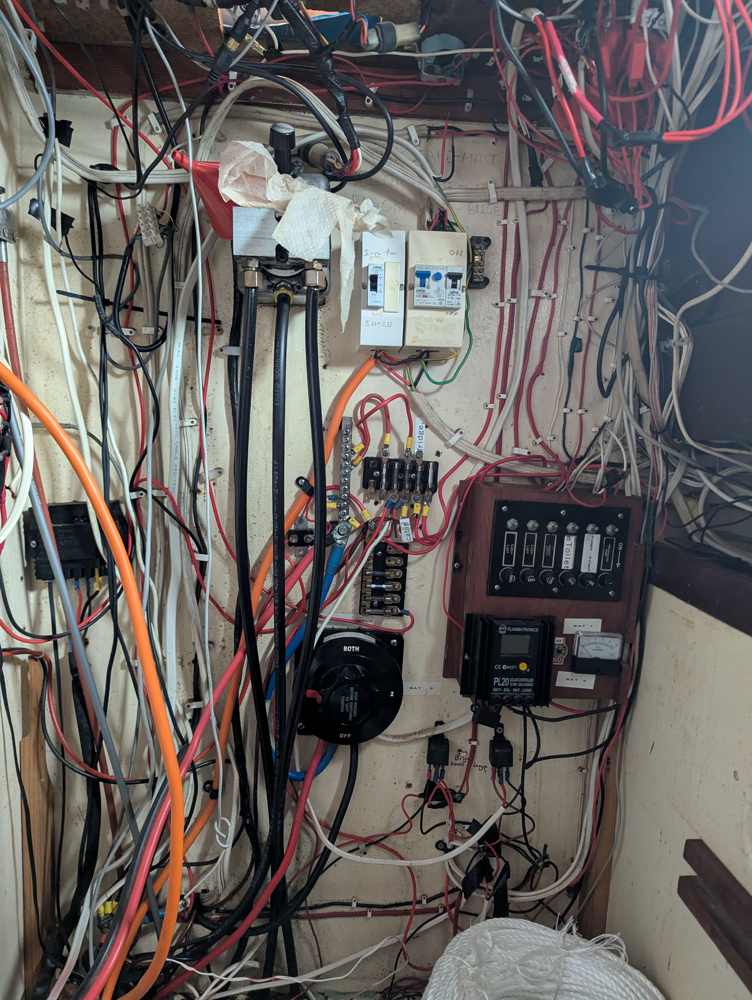
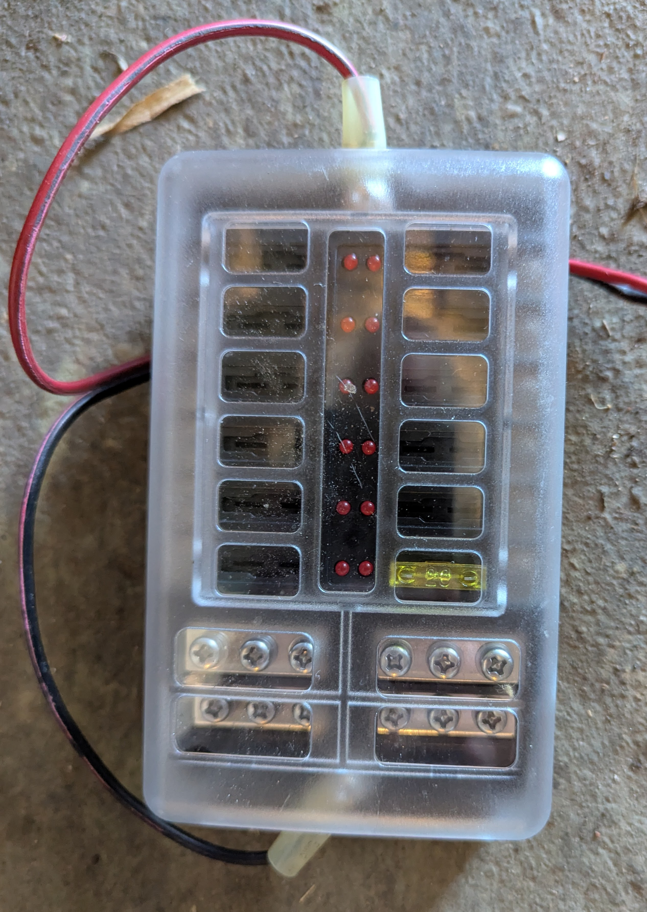
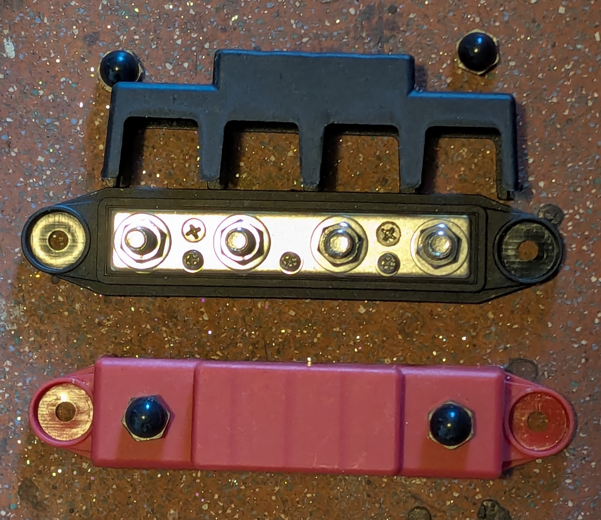
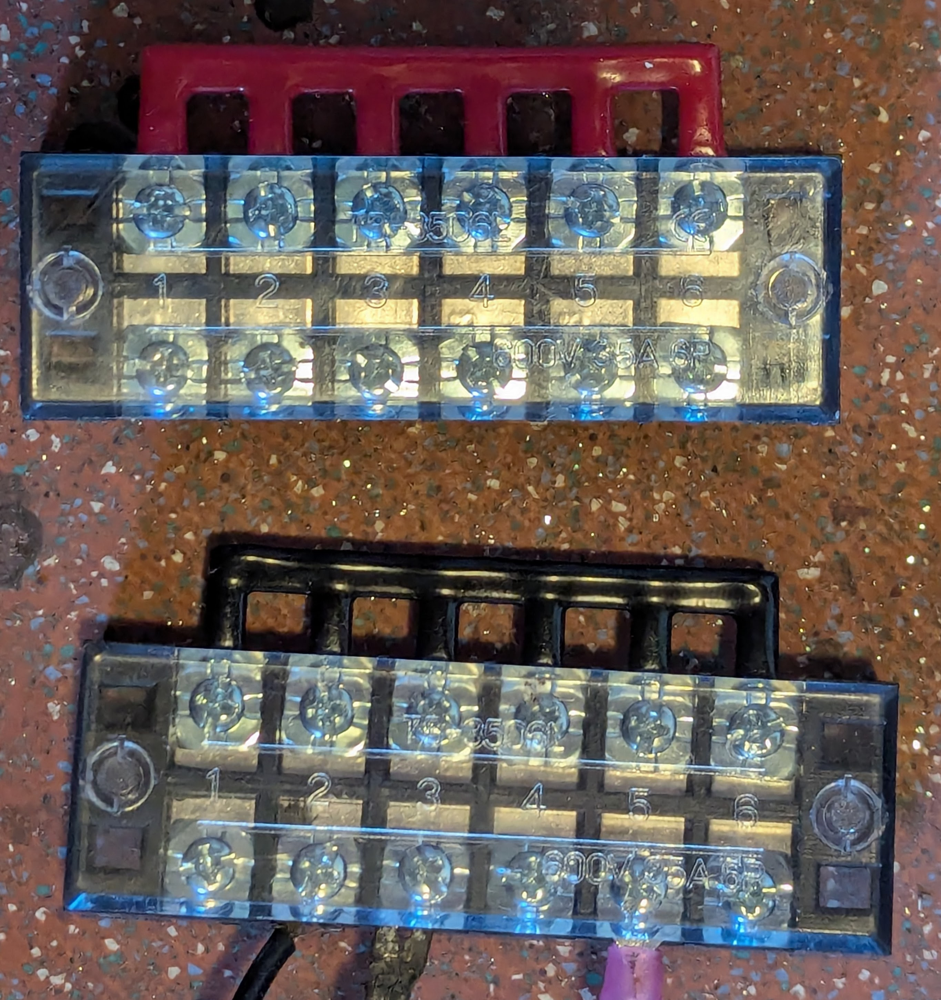
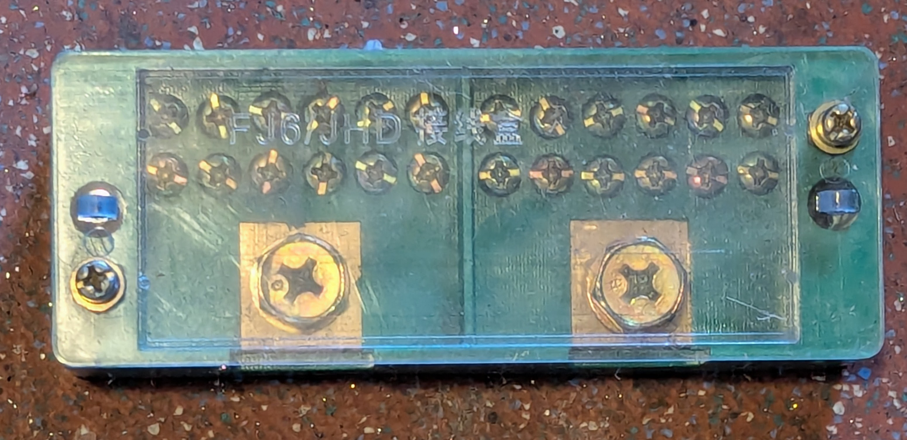
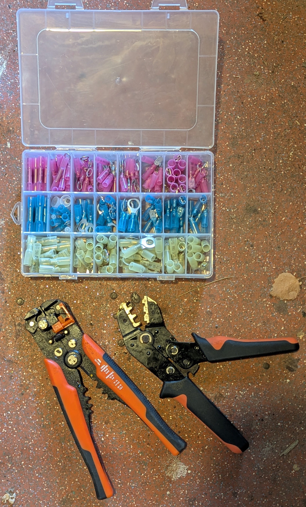
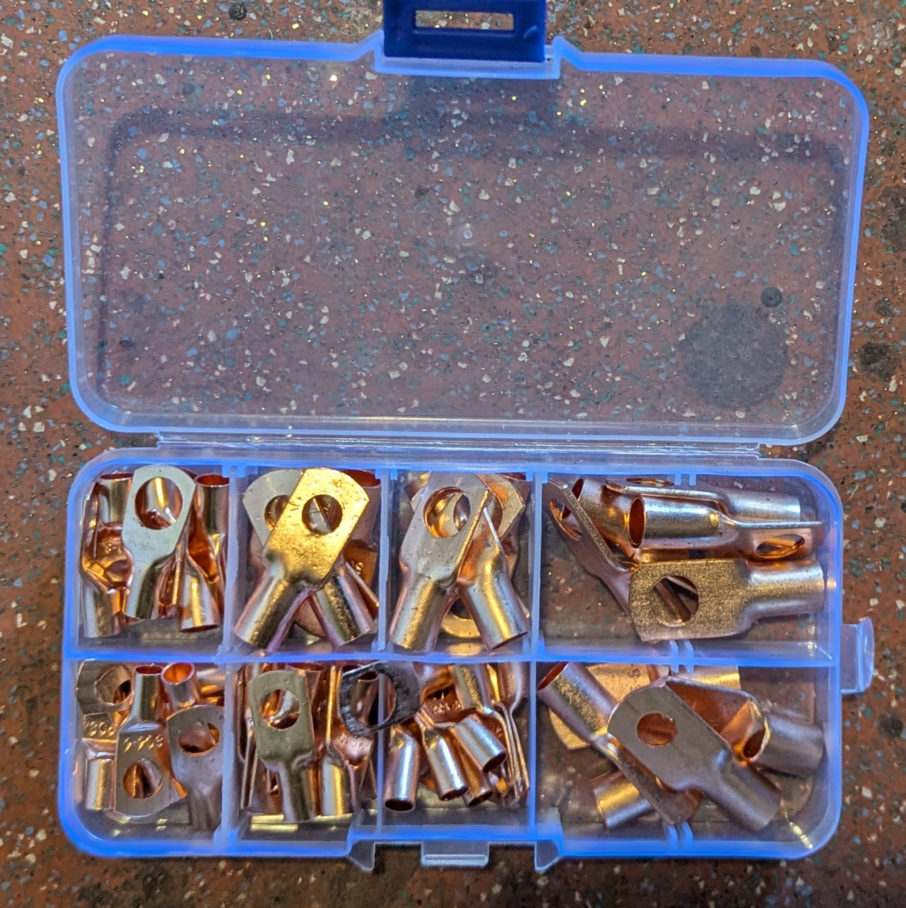
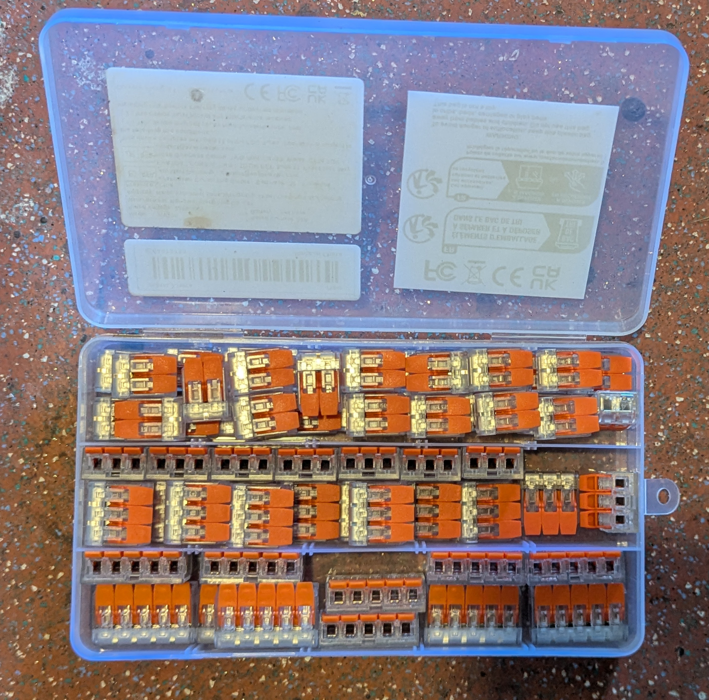

# Vessel Rewiring Plan: House & Systems

## 1. Project Overview

**Objective**: Complete removal and replacement of the existing "frightening" wiring loom to improve safety, reliability, and troubleshooting. The new system will integrate with the **Hybrid 24V/12V Topology** established in the [24V Solar System Design](24v_solar_system.md).

**Current State**:

*   *Observation*: Unlabeled wires, mixed gauges, potential "flying splices", overcrowded terminals, and heavy reliance on undocumented inline fuses.
*   *Risk*: High fire hazard, impossible to troubleshoot at sea, voltage drop issues affecting electronics.

## 2. Electrical Topology Strategy

To support the transition to a **24V House Bank** while keeping legacy **12V appliances**, we will separate the vessel into **Three Distinct Busses**.

### Bus A: 24V Primary (High Power)
*   **Source**: 24V Solar/LiFePO4/Lead-Acid Bank.
*   **Purpose**: Propulsion, bulk energy storage, and feeding the DC-DC converters.
*   **Loads**:
    *   Trolling Motor (Propulsion).
    *   Input for 12V House DC-DC Converter.
    *   Input for 12V Start-Boost DC-DC (The "Bridge").

### Bus B: 12V Regulated House (Clean Power)
*   **Source**: 24V -> 12V Buck Converter (Existing 20A unit + Potential Upgrade).
*   **Purpose**: Sensitive electronics, lights, and standard marine 12V appliances.
*   **Loads**:
    *   Cabin / Nav / Anchor Lights (LED).
    *   Instruments (Depth, Wind, PyPilot).
    *   Radios (VHF, HF).
    *   Refrigeration (Warning: High start-up current).
    *   Audio / TV.
    *   Fresh water pump.

### Bus C: 12V High-Current Legacy (Dirty Power)
*   **Source**: 12V Engine Start Battery (Charged by Alternator/Wind/Bridge).
*   **Purpose**: Legacy high-amperage motors that are too large for the Buck Converter and should not run on 24V.
*   **Loads**:
    *   **Engine Starter**.
    *   **Anchor Winch (Windlass)**: typically draws 80-100A.
    *   **Electric Toilet**: typically draws 15-20A.
    *   **Hydraulic Steering Pump (PyPilot)**: 12V Motor, 15-25A peak. Driven by IBT-2 Controller.
    *   **Shower Bilge / Main Bilge Pumps**: Safety critical.

## 3. Load Distribution Table

| System | Est. Amps (12V) | Target Bus | Notes |
| :--- | :--- | :--- | :--- |
| **AC Shore Power** | - | **AC Bus** | Needs completely separate Main Breaker Panel + RCD/ELCI. |
| Engine Starter | 100-200A | **Bus C (Start)** | Keep stock Yanmar loom. |
| Anchor Winch | 80-120A | **Bus C (Start)** | **CRITICAL**: Engine MUST be running to use Winch. |
| Electric Toilet | 15-20A | **Bus C (Start)** | Prevents dimming house lights when flushing. |
| Rudder Angle | <0.1A | **Bus B (Reg)** | Part of PyPilot system. |
| Fridge | 4-6A (Run) | **Bus B (Reg)** | Start surge ~15A. Monitor Buck converter capacity. |
| VHF Radio | 1A (Rx) / 6A (Tx) | **Bus B (Reg)** | Clean power improves reception. |
| HF Radio | 2A (Rx) / 20A (Tx)| **Bus C (Start)** | **CAUTION**: SSB Tx draws huge power. Might overload 20A Buck. Move to Start bank if heavily used. |
| Inverter | Varies | **Bus A (24V)** | **Upgrade**: Connect Inverter directly to 24V Bank for efficiency. |
| Cabin/Nav Lights | 2-5A (LED) | **Bus B (Reg)** | Move all to LED to save power. |
| Bilge Pumps | 5-10A | **Bus C (Start)** | Safety critical. Connect "Always On" via float switch to Start (or House with dedicated DC-DC if reliable). |
| Fresh Water Pump | 5-10A | **Bus B (Reg)** | Intermittent use. |
| Shower Bilge | 5-8A | **Bus B (Reg)** | Intermittent use. |
| TV / Audio | 2-4A | **Bus B (Reg)** | |
| Depth Sounder | 0.5A | **Bus B (Reg)** | |
| PyPilot Pump | 10-30A | **Bus C (Start)** | **Corrected**: Pump is 12V. Power from 12V High-Current bus to avoid 24V damage. Monitor Start Battery usage. |
| Gas Solenoid | 1A | **Bus B (Reg)** | Safety sensor constant draw. |

## 4. Hardware Requirements (BOM)

### Distribution & Protection (Inventory Updated)
We will utilize your existing inventory (Pictured Bus Blocks, 2x Fuse Blocks, Connectors):

1.  **Fuse Block #1 (Existing)**: Assign to **Bus B: 12V Regulated House**.
    *   *Role*: Distributes power to Lights, Fridge, Instruments from the Buck Converter.
2.  **Fuse Block #2 (Existing)**: Assign to **Bus A: 24V Primary**.
    *   *Role*: Distributes 24V to Trolling Motor (via breaker), IBT-2, and Buck Inputs.
    *   *Note*: Verify the fuse block is rated for 24V (most automotive blocks are rated to 32V). Use appropriate fuses (24V currents are lower!).
3.  **Positive Bus Bar (Existing)**: Use one of your **Red Bus Blocks** for the **Bus C: 12V High-Current Legacy** distribution (Toilet, Winch, PyPilot Pump). connection point.
4.  **Negative Bus Bar (Existing)**: Use your **Black Bus Blocks** for the **Common Negative ("Star Ground")**. All battery negatives and load negatives return here.

### Wiring & Terminations
*   **Tools**: Use the pictured **Crimping Tool** for all terminations. **Soldering is discouraged** on marine boats for large wire terminals due to vibration fatigue, unless using glue-lined heat shrink to support the wire.
*   **Terminals**: Use the pictured Ring Terminals for Bus connections and Spade/Fork terminals for Fuse Blocks.
*   **Standards**:
    *   **Pull Test**: Every crimp must survive a strong tug.
    *   **Heat Shrink**: Sealing the crimp prevents salt corrosion wicking up the wire.

### Branch Circuits
*   **Primary Feeds**: 4 AWG or 2 AWG from Buck Converter to 12V Fuse Block.
*   **Labels**: Heat shrink labels for EVERYTHING at BOTH ends.

## 5. Implementation Phases

### Phase 1: The Demolition
1.  **Power Down**: Disconnect ALL batteries.
2.  **Tag & Trace**: Mark every wire connected to the old panel with masking tape before cutting. Identify what it goes to.
3.  **Strip**: Remove the old "Switch Panel" and the "Frightening Wiring". Leave the labeled tails.

### Phase 2: The Core Infrastructure
1.  Mount the **Negative Bus Bar**. Run a heavy cable to Engine Block and Battery Negatives.
2.  Mount the **24V Positive Bus**. Connect to 24V Bank switch.
3.  Mount the **24V->12V Buck Converter**. Connect Input to 24V Bus, Output to the new **12V Fuse Block**.

### Phase 3: High Current 12V (Legacy)
1.  Identify the **Windlass** and **Toilet** main feeds.
2.  Route these to the **12V Start Battery Switch** (or a dedicated High-Amp distribution post connected to the Start Battery).
3.  Ensure they have appropriate inline fuses/breakers (e.g., 80A Circuit Breaker for Windlass).

### Phase 4: Branch Circuits (The Long Haul)
1.  Extend existing appliance wires to the new **12V Fuse Block**.
2.  Use proper crimp connectors (heat shrink butt connectors). **NO WIRE NUTS.**
3.  Group logic:
    *   *Circuit 1*: Navigation Lights.
    *   *Circuit 2*: Cabin Lights.
    *   *Circuit 3*: Instruments (Depth/Plotter/PyPilot Logic).
    *   *Circuit 4*: Fridge.
    *   *Circuit 5*: Fresh Water Pump.
4.  Test each circuit individually as you connect it.

### Phase 5: The Switch Panel
1.  Replace the old messy panel with a modern switch panel (with built-in breakers if possible, or use the Fuse Block protection).
2.  Wire the "Switched Positive" from the Fuse Block -> Switch -> Appliance.

## 6. Special Considerations

### The "Bridge" (DC-DC Charger)
Remember the [Hybrid Plan](lysmarine_integration.md): You should have a **12V->24V DC-DC Charger** bridging the Start Battery/Alternator to the 24V House system. Ensure this is wired with heavy gauge wire (6 AWG) and fused at both ends.

### Propane/Gas Sensor
**Safety Critical**: This should be wired to an "Always On" or "Main Breaker" circuit, not a sub-switch you might accidentally leave off. It needs to sniff gas 24/7 if gas is open.

### Bilge Pumps
Wire "Automatic" float switches directly to the battery (fused) so they run even if Master Switches are OFF. Wire "Manual" override switches to the main panel.

## 7. Hardware Inventory Reference

The following components are available for the install:

| Image | Description | Suggested Assignment |
| :---: | :--- | :--- |
|  | Fuse Block / Bus Component | **Bus B: 12V Regulated** (Lights, Electronics) |
|  | Fuse Block / Bus Component | **Bus A: 24V Primary** (Trolling, DC-DC Inputs) |
|  | Fuse Block / Bus Component | **Bus C: 12V High Current** (Positive Distribution) |
|  | Fuse Block / Bus Component | **Common Negative Bus** (Star Ground) |
|  | Wiring Tools / Terminals | General Assembly |
|  | Wiring Tools / Terminals | General Assembly |
|  | Wiring Tools / Terminals | General Assembly |

---
**Version**: 1.1
**Next Step**: Purchase Bus Bars (if extra needed) and Fuse Holders.
