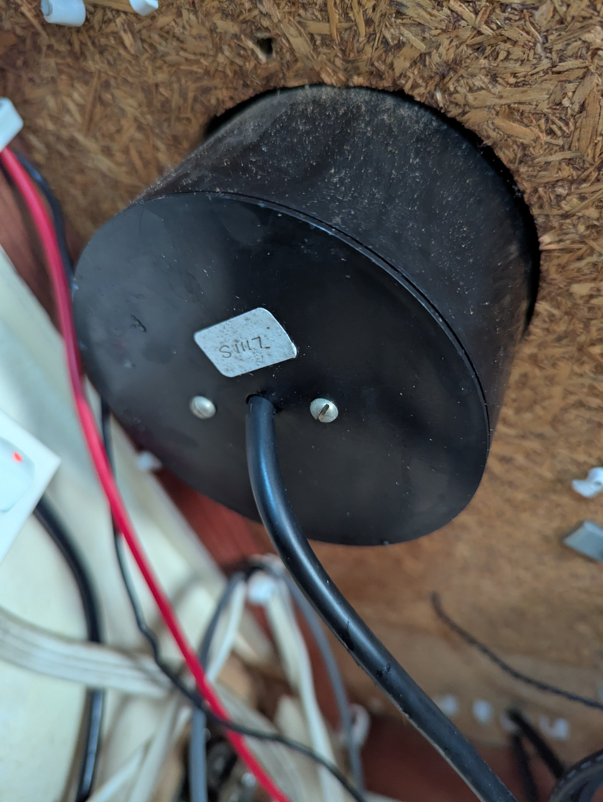
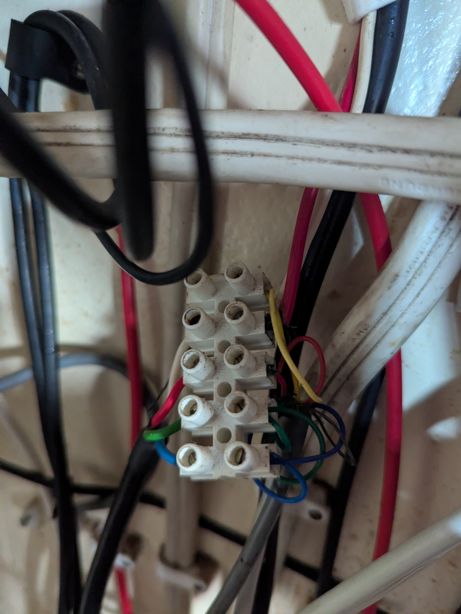
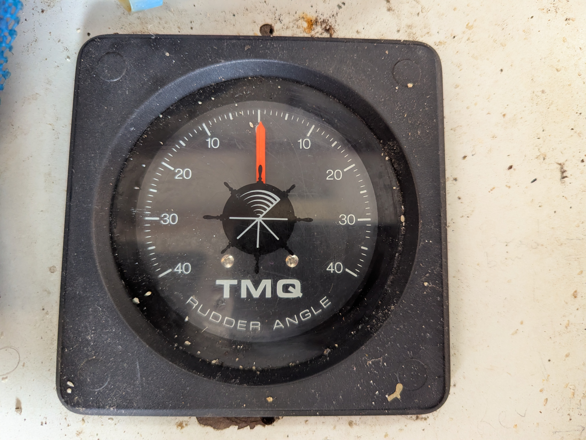
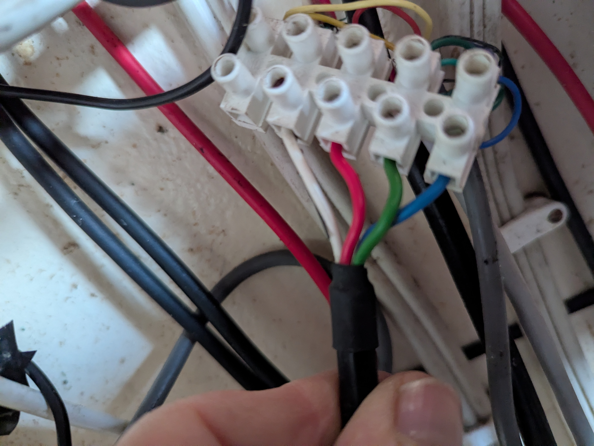

# Rudder Feedback & TMQ Gauge Integration

## Overview

This guide details how to retain the existing **TMQ Rudder Feedback Unit (RFU)** and **TMQ Rudder Gauge** (Linkage display) while integrating them into the new Pypilot system.

It also explicitly confirms the **removal** of the legacy TMQ AP8 Control Unit and the associated specific solenoid/relay drive system.

## 1. Decommissioning Legacy Components

### Removed Hardware
The following items are **removed** from the vessel as part of the upgrade:
*   **TMQ AP8 Control Head**: The old autopilot computer.
*   **Solenoids / Relays**: The 4-relay "bang-bang" H-bridge box used to drive the hydraulic pump.
    *   *Note*: The new system uses the **IBT-2 Solid State Motor Controller** which drives the Octopus pump directly via PWM. The legacy solenoids are no longer required and should be disconnected and removed to clear space.

### Retained Hardware
*   **TMQ Rudder Feedback Unit (RFU)**: The potentiometer sensor attached to the rudder stock.
*   **TMQ Rudder Gauge**: The analog display in the cockpit.
*   **Octopus 1012 Pump**: The hydraulic drive motor.

## 2. Rudder Feedback Wiring Strategy

**Goal**: Feed the rudder position signal to *both* the Cockpit Gauge (so it still looks nice) and the Pypilot Arduino (so it can steer).

**The Circuit**:
The RFU is a simple potentiometer (variable resistor). We will power it with a stable **5V** source.
*   The **Gauge** measures the voltage on the wiper to move the needle.
*   The **Arduino** measures the voltage on the wiper (Pin A4) to know the rudder angle.

### Voltage Compatibility Warning
> [!IMPORTANT]
> The original TMQ system may have powered the RFU with 12V.
> **We will switch this to 5V** to be safe for the Arduino (which dies if it sees >5V).
> *Most analog gauges work fine on 5V, they just scale the reading. If the gauge requires 12V for its internal drive but accepts a 0-5V signal, we wire power differently (see below).*

### Wiring Diagram

We will create a **Parallel Signal** setup.

```text
                            (Common Ground)
  GND Bus ------------------------+-------------------------+
                                  | (Blue)                  | (Blue)
                          +-------+-------+         +-------+-------+
                          |   TMQ RFU     |         |   TMQ Gauge   |
                          | (At Rudder)   |         |   (Cockpit)   |
                          +-------+-------+         +-------+-------+
                                  | (Green)                 | (Green)
  Signal (Wiper) -----------------+-------------------------+
          |                       |
          | (Wire splice)         |
          v                       |
     Arduino A4                (Red)                     (Red)
                                  |                         |
  +5V Bus ------------------------+-------------------------+
(From Buck Converter)
```

**Connection Table**:

| Wire Function | TMQ Wire Color | Connect To | Notes |
| :--- | :--- | :--- | :--- |
| **Ground** | Blue | **Common Negative Bus** | Shared with Arduino GND & 12V Battery Neg |
| **Power (+)** | Red | **+5V Regulated Bus** | From 24V->5V Buck Converter. **DO NOT CONNECT TO 12V** |
| **Signal (Wiper)** | Green | **Arduino Pin A4** | AND connected to Gauge Green wire |
| **Backlight** | White/Yellow? | **12V Panel Switch** | Only for gauge illumination bulb (if separate) |

## 3. Installation Steps

1.  **Identify Wires**: Locate the Red/Green/Blue bundle coming from the Rudder Stock (RFU).
2.  **Power Test**:
    *   Connect RFU Red to 5V.
    *   Connect RFU Blue to GND.
    *   Measure Voltage between Green and Blue while turning the wheel.
    *   *Expectation*: Should sweep nicely between ~0.5V and ~4.5V.
3.  **Connect Arduino**:
    *   Run a shielded signal wire from the RFU Green wire to the **Arduino Nano Pin A4** (or the center pin of the "Rudder" header if you made a PCB).
4.  **Connect Gauge**:
    *   Connect Gauge Red to 5V.
    *   Connect Gauge Blue to GND.
    *   Connect Gauge Green to the RFU Green signal.
    *   *Test*: Does the needle move?
    *   *Issue?*: If the needle is dim or barely moves, the gauge might *require* 12V power. If so: Power Gauge Red from 12V, but **ensure RFU Red is ONLY 5V**. The signal wire is then 0-5V, which most 12V gauges can still read (it might just read "half scale" as full). If this fails, you may need to lose the gauge or build a voltage divider. **Try 5V first.**

## 4. Pypilot Configuration

1.  **Boot System**: Ensure Arduino is connected to Pi Zero.
2.  **Web Interface**: Go to Calibration -> Rudder.
3.  **Range Calibration**:
    *   Turn wheel hard Port. Click **Port Limit**.
    *   Turn wheel Center. Click **Center**.
    *   Turn wheel hard Starboard. Click **Starboard Limit**.
    *   *Result*: Pypilot learns that "0.5V = -35 degrees" and "4.5V = +35 degrees".

## 5. Troubleshooting

*   **Jittery Rudder**: The gauge coil can introduce electrical noise. If the Pypilot rudder value jumps around:
    *   solder a **10uF capacitor** between the Arduino Signal (A4) and GND.
*   **Inverted**: If the gauge moves Left when you turn Right, swap +5V and GND on the RFU potentiometer itself (unlikely to be needed if color codes matched).

## Reference Images
*(Images provided by user)*

| Component | Image |
| :--- | :--- |
| **RFU Wiring** |  |
| **Terminals** |  |
| **Gauge Back**|  |
| **Control Unit**|  |

---
**Status**:
*   Solonoids: **REMOVED**
*   Legacy Computer: **REMOVED**
*   RFU/Gauge: **INTEGRATED**
